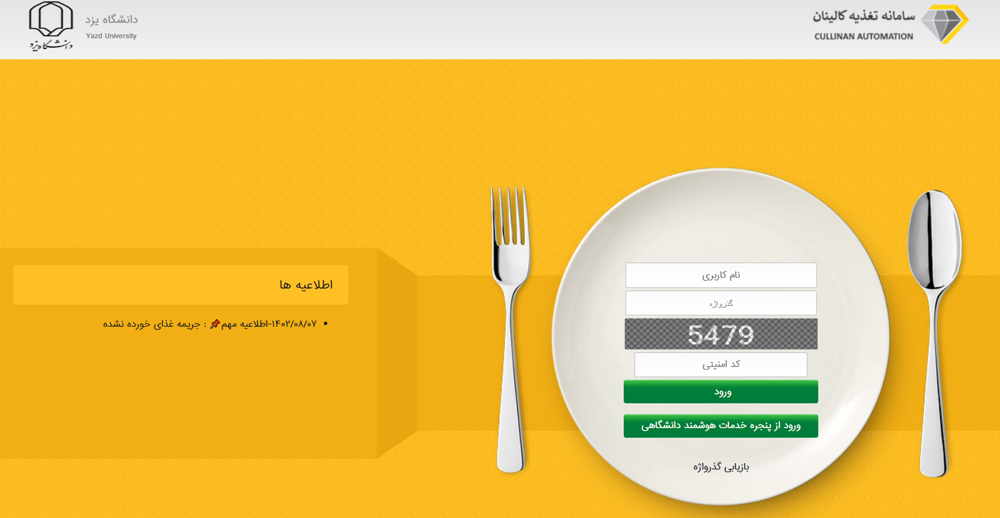
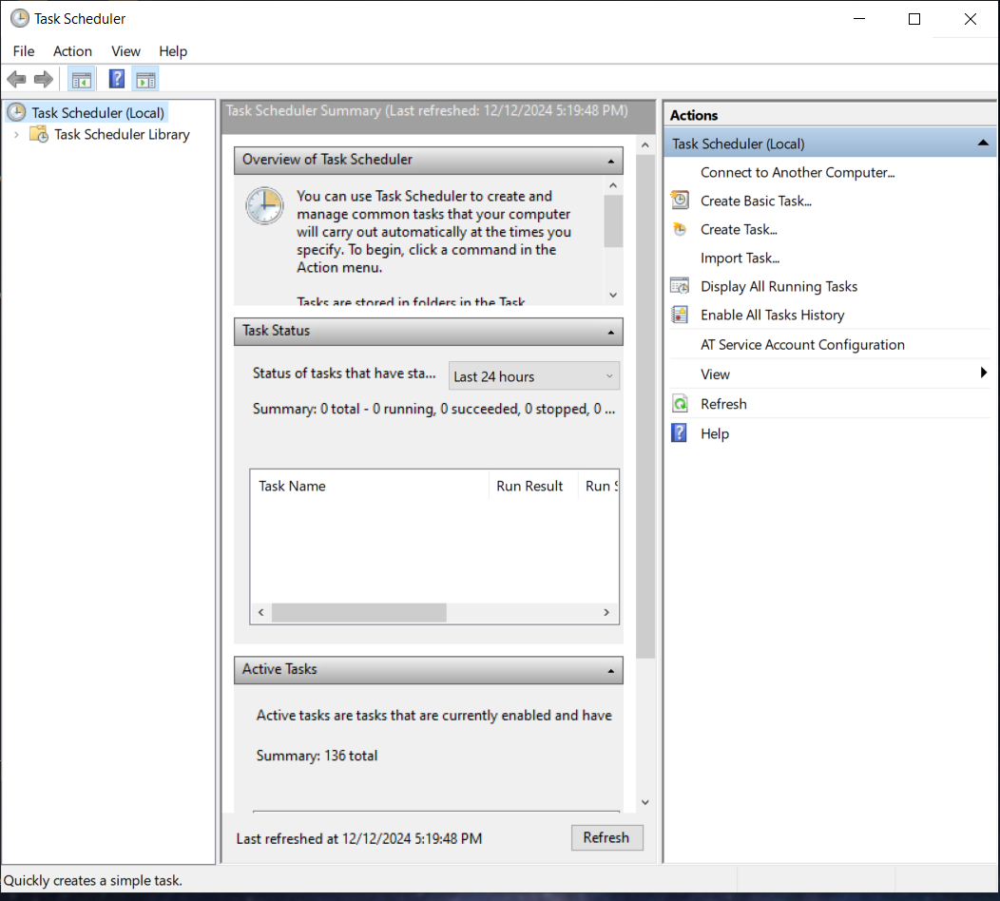
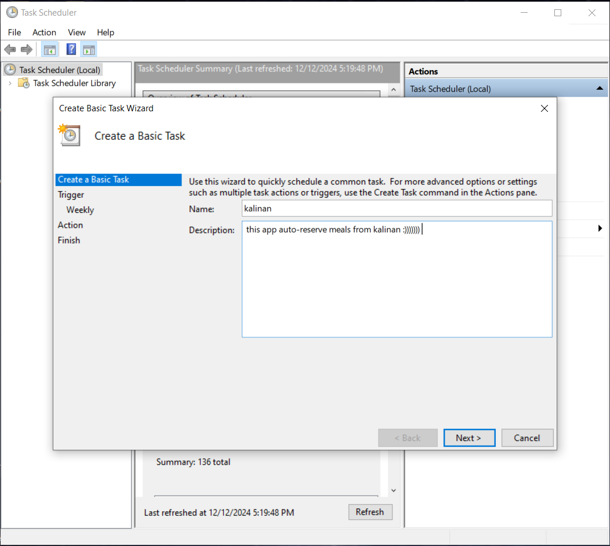
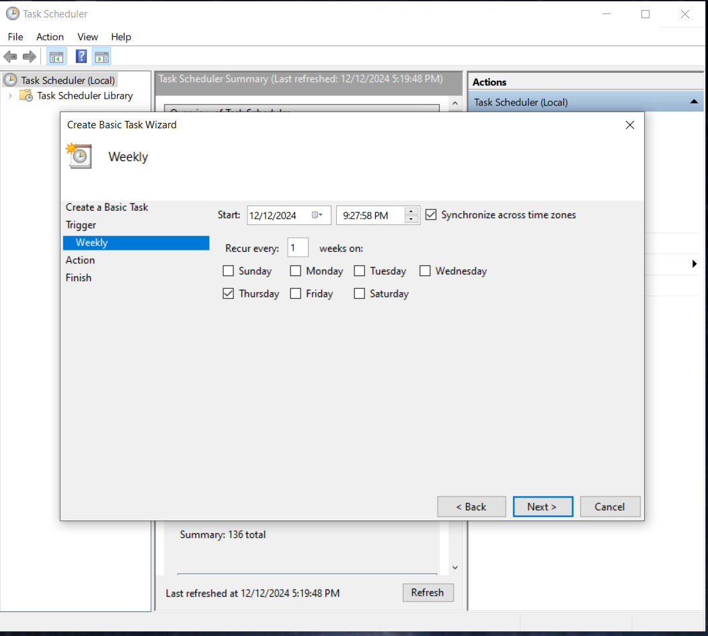
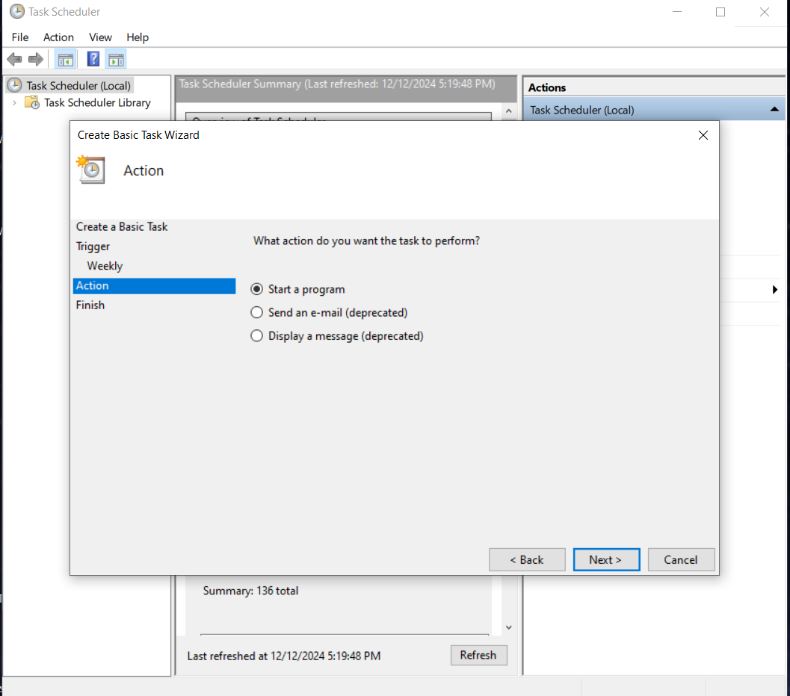
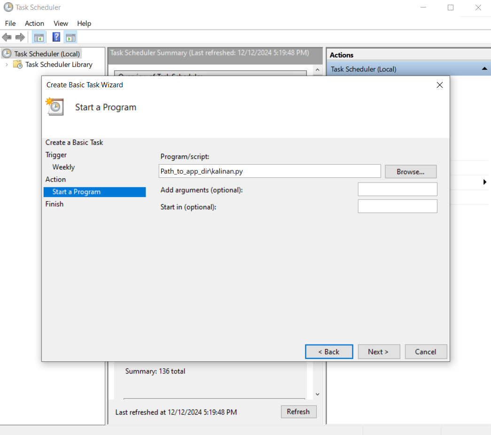

# Cullinan-auto-meal-reserver


# Overview
The **Cullinan-auto-meal-reserver** is a Python application designed to automate the weekly meal reservation process for Yazd University students through the Cullinan website (jeton.yazd.ac.ir). This application simplifies the meal reservation process, allowing students to focus on their studies while ensuring they have their meals already auto-reserved.

**Important:** The application still does not handle account credit charging. Please ensure that your account has sufficient credit before using the app. 


# Getting Started

### Prerequisites
- Python 3.x
- Required Python packages (see `requirements.txt` for details)

## Installation
1. Clone or download this repository:
   ```bash
   git clone https://github.com/mahdiahmadii/kalinan-auto-reserver-meal.git 
   ```

2. Run the `app.py` file to make the `.env` file consist of user personal info such as *Student_Number* and *Personality_Code*

3. Configure your OS settings to run the app on a specific time in a week

To ensure the app runs at a specific time, configure your operating system settings using the methods outlined below:

### For Linux:

edit the crontab (the file that contains the scheduled tasks), run the following command:

```bash
crontab -e
0 0 * * 4 /usr/bin/python3 /path/to/your/app.py
```


### For Windows:
Use Windows Task Scheduler to execute the program in specific times. follow the images below:
<figure>
    
    <figcaption>task schedule >> Create Basic Task</figcaption>
</figure>

<figure>
    
    <figcaption>fill the name of task and its description</figcaption>
</figure>

<figure>
    
    <figcaption>select weekly and specify the exact time you want the app to reserve the meal each week.</figcaption>
</figure>

<figure>
    
    <figcaption>select start program</figcaption>
</figure>

<figure>
    
    <figcaption>fill the field with  path_to_app_dir\kalinan.py</figcaption>
</figure>


# Author
Mahdi Ahmadi  
[LinkedIn](https://www.linkedin.com/in/mahdi-ahmadii)  
[GitHub](https://github.com/mahdiahmadii)


# Contributing

Feel free to fork this project and contribute to its development. Pull requests are welcome!

For any questions or suggestions, you can contact the author via LinkedIn or GitHub


